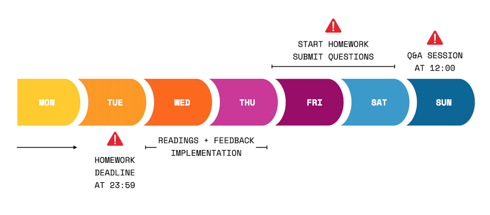

> If you are following the HackYourFuture curriculum we recommend you to start with module 1: [HTML/CSS/GIT](https://github.com/HackYourFuture/HTML-CSS). To get a complete overview of the HackYourFuture curriculum first, click [here](https://github.com/HackYourFuture/curriculum).

> Please help us improve and share your feedback! If you find better tutorials
> or links, please share them by [opening a pull request](https://github.com/HackYourFuture/JavaScript/pulls).

# Module #2 - JavaScript


In this module you'll make a start into wonderful world of programming. We will be using the programming language `JavaScript` to do so. You'll learn about the basic building blocks of programming: `loops`, `functions`, `control flow` and more. Consider these as the ABC's of programming, without them it's impossible to write working software!

You'll be learning two main things:

1. **Fundamental concepts in programming**. While we're using JavaScript to illustrate these concepts, it's important to keep in mind that what you will learn is applicable to **any** programming language. They might differ in syntax (a fancy term for the arrangement of words in a language in order for it to make sense), but the functionality will be the same: a loop will always be a loop.

This should be your mindset when you're learning concepts: **I'm learning how to become a software developer that can adjust to any language used, because I know what the underlying principles and concepts are**.

2. **How to think like a programmer**. In one sentence this means: knowing how to solve problems computationally. Let's split that up in two parts: `how to solve problems` refers to the ability to identify issues and find effective solutions. `computationally` refers to the ability to think in logical steps that the computer can understand and execute.

This should be your mindset when you're learning how to think : **I'm learning how to think in logical steps, identifying cause and effect, and always looking for solutions**.

## Before you start!

### Install some new software!

In order to test your JavaScript code, you'll be using software that will execute your files from the command line. This software is called [Node.js](https://nodejs.org/en/download/). Download the Long-Term Support (LTS) version for your specific operating system.

After you've installed it, go to your command line interface. Type in the following command:

```
node --version
```

It should show you version `v12.16.1` or higher.

### First 3 weeks

The first three weeks of this module you will be moving at your own pace. That means that we have split up the material into three sections, but feel free to go faster or slower depending on if you feel comfortable you understood the material or not. These weeks are very important, so put in the time to practice as much as possible. The homework for week 3 covers all the material in the other weeks as by then you will know all the basic building blocks that JavaScript has to offer.

After those weeks we will be going into the more tricky parts of JavaScript and start solving more complex and realistic problems that you will be facing as a developer.

### New way of working!

Starting from this module we will be using a class repository in GitHub to get used to some of the features of GitHub as well. When the first week starts you will be invited to a new GitHub repository and will be given a first issue there to enter your information. 

You will also be handing in your homework by creating issues there, starting from week 3.

## Learning goals

In order to successfully complete this module you will need to master the following:

- Have an idea of what `computer programming` is
- Know the basic building blocks of `JavaScript`
- Correctly write and use `variables`, `functions` and `loops`
- Understand the `control flow`

## How to use this repository

### Repository content

This repository consists of 2 essential parts for each week:

1. `README`: this document contains all the required theory you need to understand **while** working on the homework. It contains the list of concepts that you will want to study this week and points you to your study book to read all about them. This is the **first thing** you should start with every week
2. `MAKEME`: this document contains the instructions for each week's practical tasks / homework. Start with the exercises rather quickly, so that you can ground the concepts you read about earlier. In the first two weeks we do not expect you to hand in any homework as the online resources already check the code automatically, from week 3 our mentors will start giving you feedback on your homework.

### How to study

Let's say you are just starting out with the JavaScript module. This is what you do...

1. The week always starts on **Wednesday**. First thing you'll do is open the `README.md` for that week. For the first week of `JavaScript`, that would be [Week1 Reading](/Week1/README.md)
2. You spend **Wednesday** and **Thursday** going over the resources and try to get a basic understanding of the concepts. In the meanwhile, you'll also implement any feedback you got on last week's homework (from the HTML-CSS module)
3. On **Friday** you start with the homework, found in the `MAKEME.md`. For the first week of `JavaScript`, that would be [Week1 Homework](/Week1/MAKEME.md)
4. You spend **Friday** and **Saturday** playing around with the exercises and write down any questions you might have
5. **DEADLINE 1**: You'll submit any questions you might have before **Saturday 23.59**, in the class channel
6. On **Sunday** you'll attend class. It'll be of the Q&A format, meaning that there will be no new material. Instead your questions shall be discussed and you can learn from others
7. You spend **Monday** and **Tuesday** finalizing your homework
8. **DEADLINE 2**: You submit your homework to the right channels (GitHub) before **Tuesday 23.59**. If you can't make it on time, please communicate it with your mentor
9. Start the new week by going back to point 1!

In summary:



To have a more detailed overview of the guidelines, please read [this document](https://docs.google.com/document/d/1JUaEbxMQTyljAPFsWIbbLwwvvIXZ0VCHmCCN8RaeVIc/edit?usp=sharing) or ask your mentor/class on Slack!


## Planning

| Week | Topic                                                      | Reading Materials                                                                       | Homework                                                                                 |
| ---- | ---------------------------------------------------------- | --------------------------------------------------------------------------------------- | ---------------------------------------------------------------------------------------- |
| 1.   | Variables, Variable Types, Operators, Objects, Arrays                  | [Reading W1](/Week1/README.md) | [Homework W1](/Week1/MAKEME.md) |
| 2.   | Loops, Control Flow, If/Else, Incremental coding                       | [Reading W2](/Week2/README.md) | [Homework W2](/Week2/MAKEME.md) |
| 3.   | Functions, Scope, DRY principle                                        | [Reading W3](/Week3/README.md) | [Homework W3](/Week3/MAKEME.md) |
| 4.   | Higher Order Functions, Array functions, Closures                      | [Reading W4](/Week4/README.md) | [Homework W4](/Week4/MAKEME.md) |

## Finished?

Did you finish the module? Good job! You're doing great!

If you feel ready for the next challenge, click [here](https://www.github.com/HackYourFuture/Browsers) to go to Browsers!

_The HackYourFuture curriculum is subject to CC BY copyright. This means you can freely use our materials, but just make sure to give us credit for it :)_

<a rel="license" href="http://creativecommons.org/licenses/by/4.0/"></a><br />This work is licensed under a <a rel="license" href="http://creativecommons.org/licenses/by/4.0/">Creative Commons Attribution 4.0 International License</a>.
