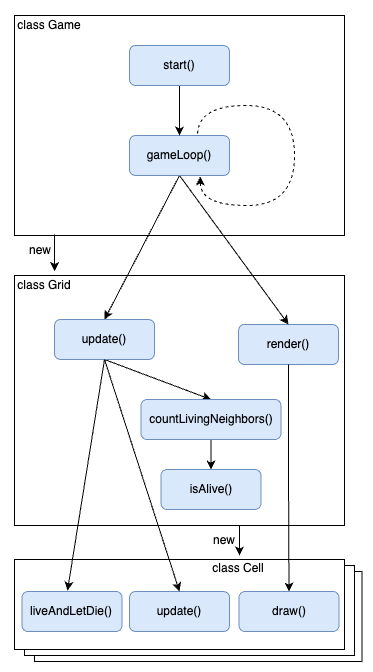
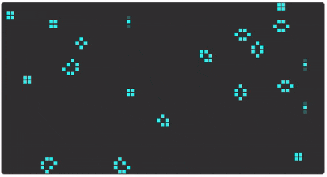

# Prep exercise: Conway's Game of Life

In this exercise you will work with existing, working code for which you are asked to implement an enhancement. The application is a JavaScript version of a classic simulation, called [Conway's Game of Life](https://en.wikipedia.org/wiki/Conway%27s_Game_of_Life).

From Wikipedia:

> The Game of Life, also known simply as Life, is a cellular automaton devised by the British mathematician John Horton Conway in 1970. It is a zero-player game, meaning that its evolution is determined by its initial state, requiring no further input. One interacts with the Game of Life by creating an initial configuration and observing how it evolves.

As illustrated in the picture below, the game is a two-dimensional grid where cells come alive and die, depending on certain rules. These rules as summarized in the Wikipedia article as follows:

1. Any live cell with two or three live neighbors survives.
2. Any dead cell with three live neighbors becomes a live cell.
3. All other live cells die in the next generation. Similarly, all other dead cells stay dead.

In the exercise code a new generation of cells replaces the previous one every 200ms. For each cell of the new generation life or death is determined by applying the above rules on the state of that same cell in the current generation.


## Code walk-through

The JavaScript code is made up of four files, three of which contain JavaScript classes (one class per file) and a file containing a `main()` function.

### `class Cell`

This class represents a single cell.

<!--prettier-ignore-->
| Methods  | Description |
|----------|-------------|
| constructor() | Initializes the cell's `x` and `y` coordinates from arguments passed to the constructor. It randomly sets the initial `alive` boolean state of the cell and initializes its next `alive` state. |
| draw() | Draws the cell on the canvas. The visual representation depends on whether the cell is alive or dead. |
| liveAndLetDie() | Determines the next state (alive or dead) depending on the number of living neighbors of the cell, by applying the rules of the Game Of Life. |
| update() | Updates the state of the cell (alive or dead) as set previously by `liveAndLetDie()`.

### `class Grid`

This class manages the game grid, made up of cells.

<!--prettier-ignore-->
| Methods  | Description |
|----------|-------------|
| `constructor()` | Creates a two-dimensional array (i.e., an array of arrays) that represents a grid of cells that evolve over time. It keeps a reference to the canvas context unto which the cells will be drawn. |
| `forEachCell()` | Executes a callback function for each cell in the two-dimensional grid array, passing the cell as a parameter to the callback. |
| `isAlive()` | Determines whether a cell at the given coordinates is alive or dead. The coordinates could potentially be off-grid. Off-grid cells are presumed to be dead. The function returns one if the given cell is alive or zero if its dead. |
| `countLivingNeighbors()` | Counts the number of living neighbors for a given cell. Each cell has eight neighbors, some of which may be off-grid if the cell is located at an edge or a corner of the grid. |
| `update()` | Iterates through all cells of the grid and computes the new state of each cell. |
| `render()` | Iterates through all cells of the grid and draws each cell onto the canvas. |

### `class Game`

<!--prettier-ignore-->
| Methods  | Description |
|----------|-------------|
| `gameLoop()` | Executes one life cycle of the game (i.e., `grid.render()` followed by `grid.update()`) and then reschedules itself to run again after a delay. |
| `start()` | The `start()` method calls `gameLoop()` to kickstart the game. |

The `main()` function gets a reference to the `canvas` element hard-coded in the `index.html` file and instantiates a `Game` object, passing the canvas reference to the `Game` constructor.

The diagram below visualizes the overall call hierarchy of the various classes and methods.



The `gameLoop()` method calls `grid.update()` to update (each cell of) the grid according to the game rules (see above) and calls `grid.render()` to render the updated grid to the web page. It then schedules a call to itself using `setTimeout()`. This causes the game to keep evolving the grid according to the game rules every 200ms until the page is closed.

Note: The use of [`window.requestAnimationFrame()`](https://developer.mozilla.org/en-US/docs/Web/API/window/requestAnimationFrame) is not essential for the functioning of the game but helps to avoid screen flicker.

### Exercise

In the supplied JavaScript code the color of all living cells is a single shade of blue. This is in contrast to the illustration above where living cells have different shades of blue, depending on their life time. Your job is as follows:

1. In the constructor of the `Cell` class, add a numeric `lifeTime` property to the object and assign it the value of `1` if the cell is initially alive or `0` if it is initially dead.

2. In `draw` method of the `Cell` class, replace [`rgb()`](<https://developer.mozilla.org/en-US/docs/Web/CSS/color_value/rgb()>) with [`rgba()`](<https://developer.mozilla.org/en-US/docs/Web/CSS/color_value/rgba()>) that adds a fourth parameter indicating `opacity` to the `rgb` value like this:

   ```js
   context.fillStyle = `rgba(24, 215, 236, ${opacity})`;
   ```

   The `opacity` of each rendered cell should depend on the cell's `lifeTime` property, as specified in this table:

   | lifeTime | opacity |
   | :------: | :-----: |
   |    1     |  0.25   |
   |    2     |   0.5   |
   |    3     |  0.75   |
   |    4+    |    1    |

3. In the `liveAndLetDie()` method of the `Cell` class add code to update the `lifeTime` value of each cell:

   - A living cell that remains living should have its `lifeTime` incremented by one.
   - A living cell that dies should have its `lifeTime` reset to zero.
   - A dead cell that is brought to life should have its `lifeTime` reset to one.

Here is a visual check that you can use to verify that the life time enhancement is correctly implemented. Most of the time, if you wait long enough, the game will "stabilize" to "still life" and "oscillator" patterns, as shown in the GIF below (see the Wikipedia article for more information about the Game Of Life patterns).



- Cells in a still life pattern remain living indefinitely and should therefore stabilize at the highest opacity.

- The oscillating parts of an oscillator pattern continually switch between life and death and, when briefly living, should have the lowest opacity. The stable parts should be at the highest opacity.

_Have fun!_
