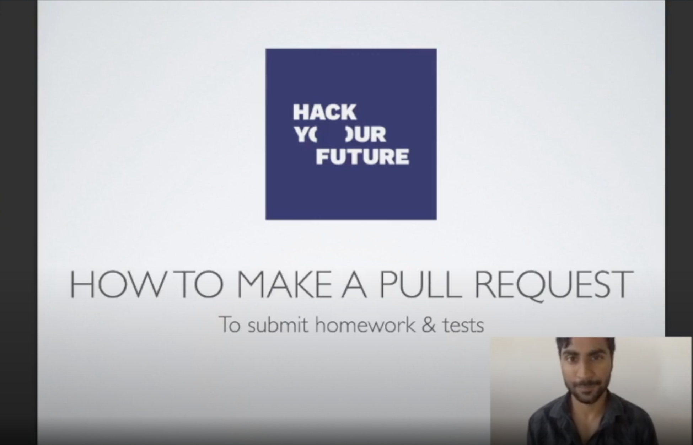

# How to hand in the weekly assignment

In this module you'll submit your assignment only using GIT and GitHub.

1. [GitHub](https://www.github.com/HackYourFuture/JavaScript)

## 1. GitHub Assignment Guide

Watch the video (by clicking the image) or go through the following walk-through to learn how to submit your assignment:

### 1.1 One Time Only (start of every module)

1. Create a [fork](https://help.github.com/en/articles/fork-a-repo) of the assignment module repository. For JavaScript (as well as the next 2 modules), the assignment module repository is `https://www.github.com/HackYourAssignment/Assignment-cohortXX` where XX is your cohort number. You do this by using the `fork` option on the top right.
2. Navigate to the URL of the cloned repository (it should be in your personal GitHub account, under "repositories").
3. Clone the repository, using SSH[1], to your local machine. You can do this by typing in `git clone <git url>` in the command line.
4. On your local machine, navigate to the folder using the command line.
5. Make sure you've cloned it correctly by running `git status` from the command line.
6. This assignment repository is a little special, have a look through the README how it all works!

### 1.2 Every Week

1. First make sure that you are in your `main` branch. If not, check it out first.
2. With your `main` branch checked out, create a new branch to work on the assignments of the new week. For example, for the assignment week 3[2] for JavaScript create a branch called `YOUR_NAME-w3-JavaScript`. Don't forget to checkout this branch after creating it. Note that you should never modify the `main` branch.
3. Make your assignment!
4. Once you're finished, add your assignment to a commit. There will be some test and config files added by the test runner, this is expected and should be added!
5. Create the commit (`git commit`). Make the commit message meaningful, for example `Finished project for assignment week 3`.
6. Push the branch to your forked repository.
7. On the GitHub page of your forked repository, click on the `create pull request` button. Make sure the `base repository` is the `Assignment-cohortXX` repository, on branch `main`.
8. Give the pull request a title in the same format as you used for the branch, e.g: `YOUR_NAME-w3-JavaScript`.
9. Submit the pull request from your forked repository branch into the `main` branch of the destination repository.

If you have any questions or if something is not entirely clear ¯\\\_(ツ)\_/¯, please ask/comment on Slack!

**Notes:**

<small>
[1] If you are in an AZC you may need to use HTTPS instead as the AZC may have blocked the network protocol used by SSH. 
[2] This first week for which you need to submit an assignment is week 2 of the JavaScript module.

</small>

# Assignments Review Process

## Before you start

1. You get assigned a mentor at the start of the module in the slack group chat. (S)He is responsible for reviewing your work for the duration of the module.
2. Please don't hesitate to contact your mentor or the education director if you are facing any issues. We are here to help you out!

## Review process

Together with the mentor and other trainees in your group you have the freedom to decide on the way of communication. You can do video calls or get feedback via comments to the PR.

The mentor will start a group message on Slack and agree together on the way of communication. There, the mentor can keep the whole group informed of his/her availability and updates.

### Video calls

If your group chooses to do video calls, there're 2 options. Individual calls or a group call.

Please write down some questions before te start of the call. During the call it is important to make notes of the feedback from the mentor, so you know what has to be adjusted afterwards.

### Comments to the PR

The mentor will place comments on your pull request. You have to adjust your work accordingly and reply on the feedback.

### Timeline feedback

| Days                                  | Activities                                                                               |
| ------------------------------------- | ---------------------------------------------------------------------------------------- |
| Tuesday (week 1)                      | Deadline for you to hand in your first version                                           |
| Wednesday (week 1) - Tuesday (week 2) | Mentor provides feedback                                                                 |
| Wednesday (week 2) - Tuesday (week 3) | you improve the assignment based on the feedback and mentor evaluates improvements       |
| Wednesday (week 3)                    | Core-team member Assignment Approval Check. At this point every PR needs to be approved. |

It can happen that your mentor doesn't reply on your questions or your updated assignment. Please send a reminder via slack. If that doesn't work and you're afraid you can't make the deadline, contact your cohort supervisor.

### Labels

It is important for the you and the core-team to have up to date info about the status of the assignment. This is why the mentors use two labels on your PR.

| Label      | Description                                     |
| ---------- | ----------------------------------------------- |
| no label   | not reviewed yet                                |
| Needs work | reviewed, but you need to implement feedback    |
| Approved   | reviewed, and your assignment has been approved |

Here is an example of this in action.

